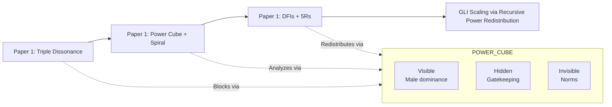

```mermaid
graph LR
    A[Paper 1: Triple Dissonance] --> B[Paper 1: Power Cube + Spiral]
    B --> C[Paper 1: DFIs + 5Rs]
    
    subgraph POWER_CUBE
        V1[Visible<br/>Male dominance]
        H1[Hidden<br/>Gatekeeping]
        I1[Invisible<br/>Norms]
    end
    
    A -.->|Blocks via| POWER_CUBE
    B -.->|Analyzes via| POWER_CUBE
    C -.->|Redistributes via| POWER_CUBE
    
    C --> D[GLI Scaling via Recursive Power Redistribution]
```
