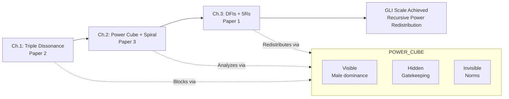

```mermaid
graph LR
    A[Ch.1: Triple Dissonance<br/>Paper 2] --> B[Ch.2: Power Cube + Spiral<br/>Paper 3]
    B --> C[Ch.3: DFIs + 5Rs<br/>Paper 1]
    
    subgraph POWER_CUBE
        V1[Visible<br/>Male dominance]
        H1[Hidden<br/>Gatekeeping]
        I1[Invisible<br/>Norms]
    end
    
    A -.->|Blocks via| POWER_CUBE
    B -.->|Analyzes via| POWER_CUBE
    C -.->|Redistributes via| POWER_CUBE
    
    C --> D[GLI Scale Achieved<br/>Recursive Power Redistribution]
```
